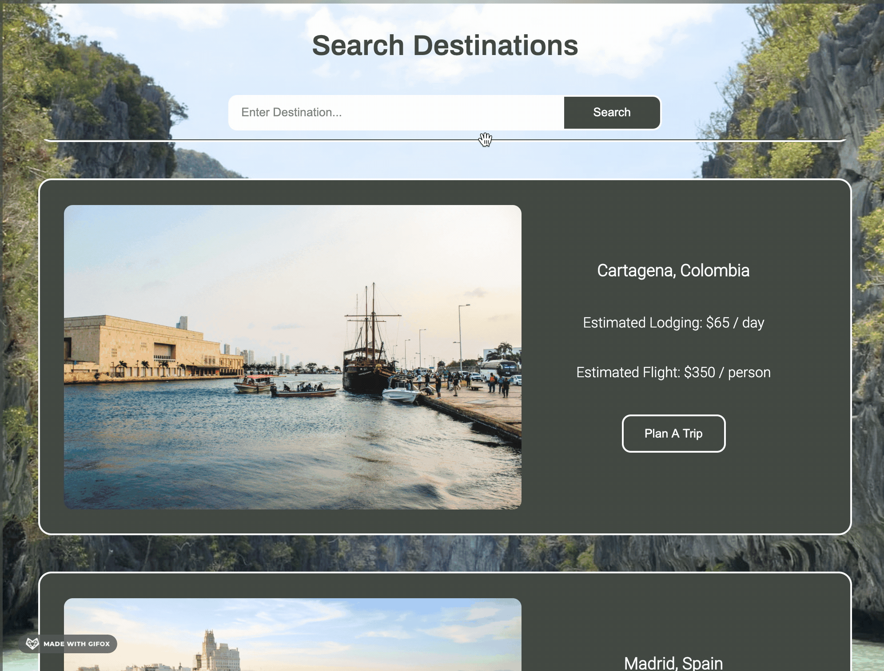
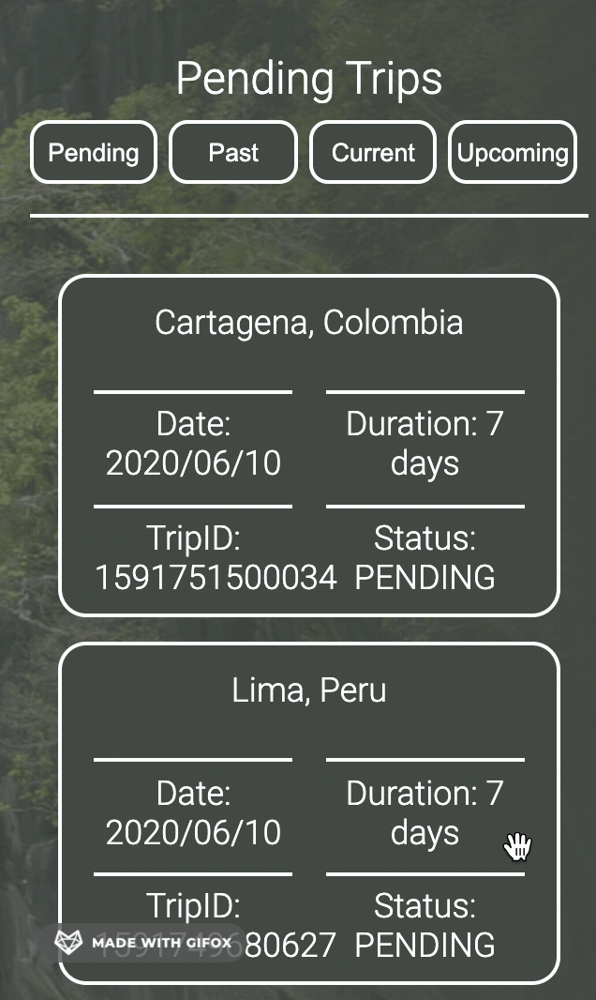

## Abstract
Travel-Tracker is an application that manages and tracks trips for individual users as well as a travel agency.  A user is able to login as a traveler and will find a dashboard displaying all of their personal information including trips and the total amount they have spent on trips this year.  In addition, the user may book a trip to be reviewed by a travel agent.  While logged in as an agent, the user may look at all trips and approve or deny pending trips, as well as cancel upcoming trips.  The agent can also see all of the travelers' information.

### Learning Goals
 - Use OOP to drive the design of the application and the code
 - Work with an API to send and receive data
 - Solidify the code review process
 - Create a robust test suite that thoroughly tests all functionality of a client-side application

### Set Up
Open your terminal and run the following command: git clone git@github.com:KyleWong2510/Travel-Tracker.git
Once the repository is cloned down, run: npm install
After install, run: npm start
In your browser, go to: http://localhost:8080/

OR

See it in action [here](https://kylewong2510.github.io/Travel-Tracker/)

### Demo 

#### Logging In

#### Traveler View: Searching a destination

#### Traveler View: Filtering trips

#### Agent View: Searching a traveler

#### Agent View: Approving a trip request

### Technologies Used
- fetch API
- Javascript
- SCSS
- Mocha and Chai

### Future Iterations
- Stronger accessibility
- Implementation of Spies testing
- Responsive for mobile layouts
- Fix minor display bugs on POST
